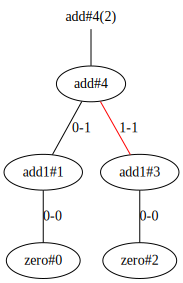
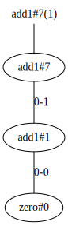
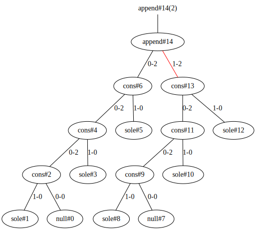
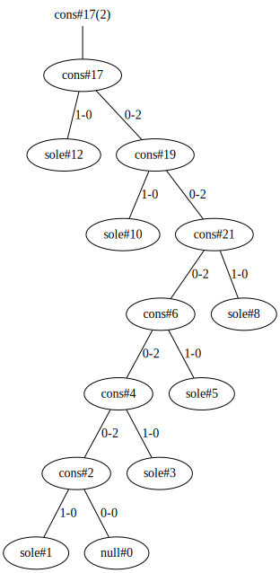
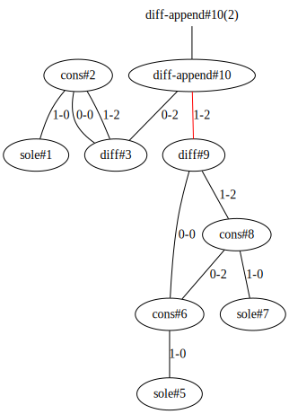
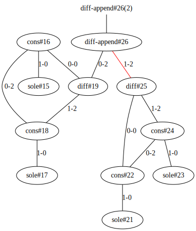
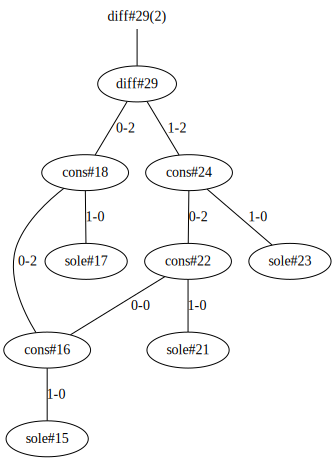

# Interaction Nets

An implementation of [Interaction Nets](https://en.wikipedia.org/wiki/Interaction_nets) in JavaScript.

- Use [S-expression](https://github.com/cicada-lang/sexp) as overall syntax.
- Use Forth-like postfix stack-based syntax to build Interaction Nets.

## Installation

```
npm -g i @cicada-lang/inet
```

The command line program is called `inet`.

## Examples

### Natual number

```clojure
(define-cons zero 0)
(define-cons add1 1)

(define-elim add 2)
(define-rule (zero add))
(define-rule (add1 add) add add1)

(define-net two
  zero add1
  zero add1
  add)
```

```
inet render docs/tests/nat.inet
```

| `two` initial                              | `two` finial                              |
| ------------------------------------------ | ----------------------------------------- |
|  |  |

### List

```clojure
;; A trivial data for testing.
(define-cons sole 0)

(define-cons null 0)
(define-cons cons 2)

(define-elim append 2)
(define-rule (null append))
(define-rule (cons append) (let head) append head cons)

(define-net six-soles
  null sole cons sole cons sole cons
  null sole cons sole cons sole cons
  append)
```

```
inet render docs/tests/list.inet
```

| `six-soles` initial                               | `six-soles` finial                               |
| ------------------------------------------------- | ------------------------------------------------ |
|  |  |

### Difference list

[Wikipedia / Difference list](https://en.wikipedia.org/wiki/Difference_list).

```clojure
(define-cons diff 2)

(define-elim diff-append 2)
(define-rule (diff diff-append)
  (let that left right)
  left that diff-open right diff)

(define-elim diff-open 2)
(define-rule (diff diff-open)
  (let right) connect right)

(define-net one-two-soles
  wire sole cons diff
  wire sole cons sole cons diff
  diff-append)

(define-net two-two-soles
  wire sole cons sole cons diff
  wire sole cons sole cons diff
  diff-append)
```

```
inet render docs/tests/diff-list.inet
```

| `one-two-soles` initial                                    | `one-two-soles` finial                                    |
| ---------------------------------------------------------- | --------------------------------------------------------- |
|  |  |

| `two-two-soles` initial                                    | `two-two-soles` finial                                    |
| ---------------------------------------------------------- | --------------------------------------------------------- |
|  |  |

## Development

```
npm install    // Install dependencies
npm run build  // Compile `src/` to `lib/`
npm run watch  // Watch the compilation
npm run test   // Run test
```

## Contributions

> Be polite, do not bring negative emotion to others.

- [TODO.md](TODO.md)
- [STYLE-GUIDE.md](STYLE-GUIDE.md)
- [CODE-OF-CONDUCT.md](CODE-OF-CONDUCT.md)
- When contributing, add yourself to [AUTHORS](AUTHORS)

## License

- [GPLv3](LICENSE)
